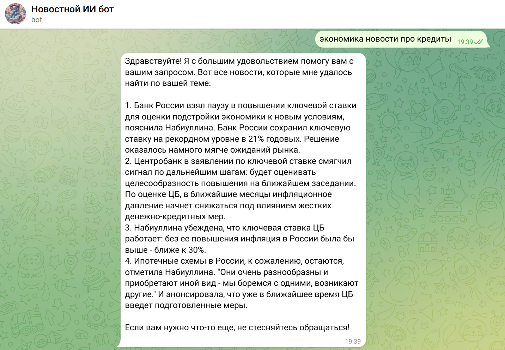

<div id="top"></div>

<!-- PROJECT LOGO -->
<br />
<div align="center">


<h3 align="center"><a href="https://t.me/AINewsSummarizerBot">AI News Bot</a></h3>


</div>

# News AI-based Chat Delivery Project

This Retrieval-Augmented Generation (RAG) project is designed to provide up-to-date news on specified topics and dates. Users can request specific news, such as "news about OpenAI model updates," as well as more general topics like "sports news."

The project integrates several technologies to ensure efficient operation:

1. **MySQL Database**: Used for storing and managing news data, allowing for quick and efficient processing of user requests.

2. **FAISS Index**: Applied for fast search and retrieval of relevant information from large volumes of data, significantly speeding up the process of finding the necessary news.

3. **OpenAI GPT-4o**: Used for text generation and delivering news in a chat format, making user interaction more natural and convenient.

Users can interact with the system through several interfaces:

- **API**: Allows integration of the project's functionality into other applications and services.
- **Gradio UI**: Provides a user-friendly web interface for interacting with the system.
- **Telegram Bot**: Offers the ability to receive news and interact with the project through a popular messenger, making access to information more mobile and convenient.

The project is focused on providing accurate and timely information, giving users flexibility in choosing topics and formats for receiving news.

## Our mission
Our mission is to revolutionize news consumption by providing users with the most relevant updates tailored to their specific interests, saving them valuable time. In an age of information overload, our AI-driven system efficiently filters through vast news streams to deliver precise and timely content. By focusing on relevance and personalization, we ensure that users receive only the news that truly matters to them, enhancing their experience and empowering them to stay informed effortlessly.

## About the Project

Our project is designed to optimize news delivery through a series of interconnected modules:

1. **Parsing and Database Management**: We continuously parse news from various news Telegram channels, storing the information in a MySQL database to ensure a comprehensive and up-to-date repository.

2. **Domain Relevance Check**: Using a language model (LLM), we verify the relevance of users request, ensuring that request is provided to find news.

3. **Query Analysis**: The LLM extracts themes and dates from user queries, allowing for precise and targeted news retrieval.

4. **News Retrieval**: Based on the identified themes and dates, our system fetches relevant news from the MySQL database.

5. **Similarity Search with FAISS**: We employ FAISS to find news articles that closely match the user's query, enhancing the relevance of the results.

6. **Relevance Filtering**: Using a combination of MapReduce and LLM, we select the most pertinent news items from those identified by FAISS, ensuring high-quality results.

7. **Response Generation**: Finally, the LLM crafts a comprehensive response, providing users with a summary and a curated list of relevant news articles.

This modular approach ensures efficient and accurate news delivery, tailored to the user's needs.

## Architecture
   

## Metrics

| Metrics  | Result  | Description  |
|---|---|---|
| Response vs reference answer | 0,68 | This metric shows similarity between LLM answer and target answer|
| Response vs input | 0,77 | This metric shows correspondence between LLM answer and user's query |
| Response vs retrieved docs | 0,70 | This metrics show correspondence between LLM answer and retrieved passages |
| Retrieved docs vs input | 0,50 | This metric shows correspondence between user's query and retrieved passages |


## [Telegram bot](https://t.me/AINewsSummarizerBot) example
   

## UI example
   

## API example
   

## Technology steck

 - [Faiss](https://github.com/facebookresearch/faiss)
 - [MySQL](https://www.mysql.com/)
 - [FastAPI](https://fastapi.tiangolo.com/)
 - [OpenAI](https://openai.com/)
 - [Sentence Transformers](https://www.sbert.net/)
 - [Gradio](https://gradio.app/)
 - [Telegram](https://telegram.org/)


## Data description
 - You can download data via YandexDisk from [here](https://disk.yandex.ru/d/Tz5hsycHYzRJKg)
 - Original data consists of `7516 rows`
 - There are monthly news from 5 thematic Telegram channels:
   1. Economics
   2. Sport
   3. AI
   4. IT
   5. Sciense
 - Columns: `message_id`, `chat_id`, `message_date`, `content`, `theme`

## Installation

### Step 1: Create a .env File

Add a `.env` file to the root directory of the project with the following content:

#### Example .env
```bash
# Embedder settings
EMBEDDER_PORT=8040
SPECIFIC_MODEL="" # will be chosen default model
CUDA_VISIBLE_DEVICES_EMB=all

#DB settings
DB_SERVICE_PORT=8020
DB_HOST=mysql
DB_PORT=3306
DB_NAME=mydatabase
DB_USER=root
DB_ROOT_PASSWORD=123
CSV_PATH="/db_service/news_data/news.csv"

# RAG settings
RAG_MANAGER_PORT=8030

# Neural GPT worker settings
WORKER_PORT=8050
GPT_TOKEN="sk-"
BASE_GPT_URL="https://api.proxyapi.ru/openai/v1" 

#Bot settings
USE_BOT=0
BOT_API_TOKEN=""

#Parser settings
USE_PARSER=0
API_ID=
API_HASH=''
PHONE='+7'

#Gradio settings
GRADIO_PORT=8060
```

Fill in the variables with the appropriate values.

### Step 2: Build and Start Containers

1. **Build Containers**

   Run the following command to build the Docker containers:

   ```bash
   docker-compose build
   ```

2. ** **

   Start the containers in detached mode:

   ```bash
   docker-compose up -d
   ```
### Step 3 (Optional): Start Telegram Bot

1. **Create a Bot for Telegram using Botfather**

2. **Add your bot token to .env**
   ```bash
   USE_BOT=1
   BOT_API_TOKEN="your_token"
   ```

### Step 4 (Optional): Start Telegram Parser

1. **Create a Telegram API**
   
   It is strongly recommended to use a virtual number, the telethon may cause you to log out of your account and temporarily lose it 
   

2. **Add your api params to .env**
   ```bash
   USE_PARSER=1
   API_ID=
   API_HASH=''
   PHONE='+7'
   ```
   
## Authors

- <a href="https://t.me/nikuto11">Busko Nikita</a>
- <a href="https://t.me/helilozium">Rychkov Pavel</a>
- <a href="https://t.me/oran9e_lime">Orlova Angelina</a>

